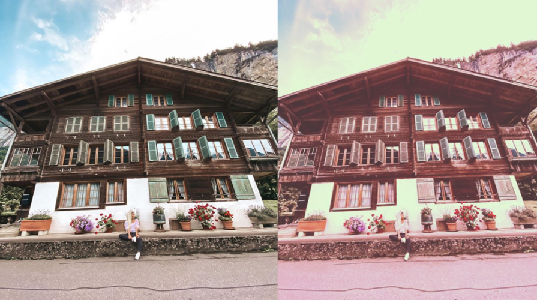

# Instagram-Filters-with-Python
Create beautiful Instagram-like filters using Python and machine learning libraries. This project demonstrates how to use the Instafilter library with OpenCV to apply professional image filters easily. Perfect for beginners exploring image processing and ML-powered effects.

## 📌 What Are Instagram Filters?
If you've ever uploaded a photo to Instagram, you’ve seen amazing filters that enhance images by improving color, brightness, and quality. These effects are powered by machine learning algorithms. With Python, we can replicate similar effects using Instafilter.

---

## 🚀 Features
- Apply Instagram-style filters to any image
- Uses Instafilter Machine Learning library
- Uses OpenCV for image processing
- Simple and beginner friendly
- Fully reusable script

---

## 🛠️ Technologies Used
- Python
- Instafilter
- OpenCV (cv2)

---

## 🖼 Application Screenshot

---

## 🤝 Contribution
Feel free to fork, enhance and reuse this project!
